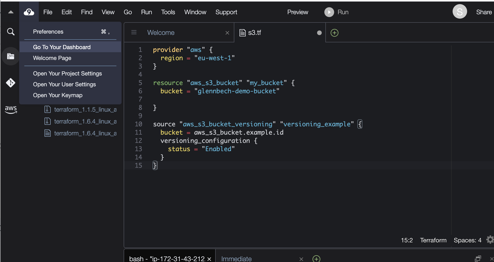

# AWS S3 and Terraform Exercise

This exercise is designed to give you hands-on experience with managing AWS S3 buckets 
through both the AWS Management Console and Terraform. It will cover creating and deleting 
buckets manually, uploading files, and then automating these processes with Terraform, including 
enabling encryption.

## Part 1: Using the AWS Management Console

### Step 1: Creating an S3 Bucket

1. Log in to the AWS Management Console with your credentials.
2. Navigate to the S3 service page.
3. Click on **Create bucket**.
4. For the bucket name, use a unique name that can be easily identified as yours (e.g., your AWS credentials or a variation of your name).
5. Select the ```eu-west-1``` region to you for the bucket.
6. Leave the default settings, and click **Create** at the bottom of the page.

### Step 2: Uploading a File to the Bucket

1. After creating your bucket, click on its name to open it. Or Press the "View details" in he green confirmation bar on the top of the screen.
2. Click on **Upload**.
3. Click on **Add files**, and select a file from your computer to upload.
4. After adding the file, click on **Upload** at the bottom of the page.

### Step 3: Deleting the Bucket

1. Navigate back to the main S3 page where all buckets are listed.
2. Select the bucket you created by clicking the checkbox next to its name.
3. Click on **Delete**.
4. Take not of the warning "This bucket is not empty", click the "Empty bucket" 
5. You will be asked to confirm the bucket deletion by entering its name. Or "Permanently delete". Do so, then click **Confirm**.

## Part 2: Automating with Terraform

* You will do this part in your Cloud9 environment. From the AWS menu, find the "Services" Icon, and find Cloud 9
* You will see an environment with your seat number on it. Clik the "open" link

Spend a few moments to familirise yourself with Cloud9, a capable web based IDE. 

### Step 0: Install terraform 

Unfortunately Cloud9 no longer comes with Terraform installed, so we have to install it 

```bash
wget https://releases.hashicorp.com/terraform/1.6.4/terraform_1.6.4_linux_amd64.zip
unzip terraform_1.6.4_linux_amd64.zip
sudo mv terraform /usr/local/bin/
```

### Step 1: Writing Terraform Code for the S3 Bucket

Instead of creating a bucket manually, we'll now see how we can do the same from Terraform. 
Create a new Terraform  file (`s3_bucket.tf`) in your Cloud 9 editor with the following content:

Replace region and bucket attributes

```hcl
provider "aws" {
  region = "eu-west-1"
}

resource "aws_s3_bucket" "my_bucket" {
  bucket = "your-unique-bucket-name"
}
```

### Step 2: Initializing and Planning with Terraform

1. Go to the terminal window on the bottom of the Cloud 9 environment.
2. Run `terraform init` to initialize the Terraform workspace.
3. Run `terraform plan` to see the actions Terraform will take based on your configuration.

### Step 3: Applying the Terraform Configuration

1. Run `terraform apply` and type `yes` when prompted to create the bucket.
2. Run `terraform plan` again, and see that there is no change 

### Step 4: Testing the Bucket
1. To navigate to the AWS Management Console from Cloud 9, press the Cloud9 Icon in the upper left corner and press "Go to your Dashboard"
2. Manually upload a file to the bucket through the AWS Management Console, as described in Part 1, Step 2.


 
### Step 5: Add some tags to your bucket 
In AWS all resources can have Tags, key value pairs that can make it easier to find and categorise resources

1. Modify the `s3_bucket.tf` file to enable server-side encryption by adding the following block inside the `aws_s3_bucket` resource:

```hcl
  tags = {
    Environment = "Dev"
  }
```

2. Run `terraform plan` and `terraform apply` to add the tags 

Observe that during the plan phase, Terraform wil output the changes needed to reach 
the desired state. The ~ sign means that a resource will change, a +/- means that a 
resource will be replaced. a + means that a resource will be removed, and a + that a resource 
will be created.

```shell
Terraform will perform the following actions:

  # aws_s3_bucket.my_bucket will be updated in-place
  ~ resource "aws_s3_bucket" "my_bucket" {
        id                          = "glennbech-demo-bucket"
      ~ tags                        = {
          + "Environment" = "Dev"
        }
      ~ tags_all                    = {
          + "Environment" = "Dev"
        }
        # (10 unchanged attributes hidden)

        # (3 unchanged blocks hidden)
    }

Plan: 0 to add, 1 to change, 0 to destroy.
```

### Step 6: Emptying the Bucket Using the CLI

1. Use the AWS CLI to empty the bucket:

```sh
aws s3 rm s3://your-unique-bucket-name --recursive
```

### Step 7: Destroying the Bucket with Terraform

1. Run `terraform destroy` to remove the bucket and all its configurations.
